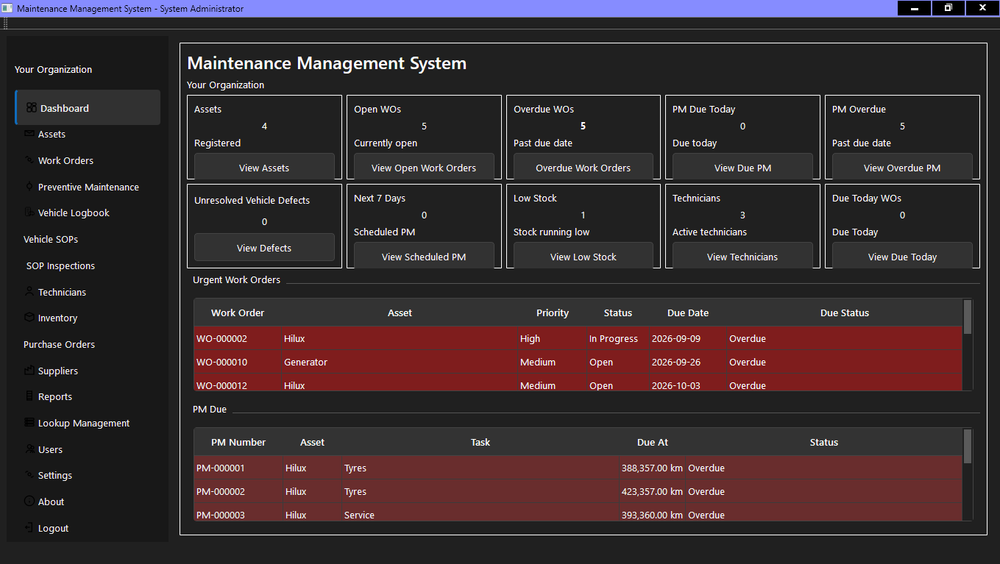

# Maintenance Management System (MMS)

## Overview

The Maintenance Management System (MMS) is a desktop Computerized Maintenance
Management System (CMMS) developed using Python, PySide6, Qt and SQLite.

The application is designed to manage maintenance operations including assets,
work orders, preventive maintenance, technicians, inventory, purchasing,
vehicle/equipment inspections, meter readings and maintenance reporting.

The project uses a layered architecture to separate the user interface,
business logic and database access.

---

## Application Preview



---

## Current Features

- User authentication and role-based permissions
- Maintenance dashboard
- Asset management
- Asset history
- Asset meter readings
- Technician management
- Work order management
- Work order history
- Work order labour and time tracking
- Work order parts and materials
- Preventive maintenance scheduling
- Calendar-based preventive maintenance
- Meter-based preventive maintenance
- Inventory management
- Inventory transaction history
- Low-stock monitoring
- Supplier management
- Purchase orders
- Purchase order receiving
- Vehicle/equipment logbook
- Vehicle/equipment SOP definitions
- SOP inspection checklists
- Completed SOP inspection history
- Failed SOP inspection item to Work Order workflow
- Printable blank SOP inspection forms
- Printable completed SOP inspection reports
- Maintenance and operational reports
- PDF and spreadsheet report export
- Database backup support

---

## Technologies

- Python 3
- PySide6
- Qt / Qt Designer
- SQLite
- ReportLab
- bcrypt
- openpyxl

---

## Architecture

The application follows a layered architecture:

```text
Qt User Interface
       |
       v
Pages / Dialogs
       |
       v
Services
       |
       v
Models
       |
       v
SQLite Database
```

Application startup initializes the database schema, applies database
migrations and seeds required default data before presenting the login
interface.

---

## Project Structure

```text
MaintenanceSystem/
|
|-- app/
|   |-- base/
|   |-- controllers/
|   |-- core/
|   |-- database/
|   |-- dialogs/
|   |-- helpers/
|   |-- models/
|   |-- pages/
|   |-- resources/
|   |-- services/
|   |-- ui/
|   |-- utils/
|   `-- widgets/
|
|-- docs/
|-- tests/
|-- main.py
|-- requirement.txt
|-- README.md
`-- LICENSE
```

---

## Development Setup

Create and activate a Python virtual environment, then install the required
dependencies.

Example on Windows:

```powershell
python -m venv venv
.\venv\Scripts\Activate.ps1
pip install -r requirement.txt
```

Run the application with:

```powershell
python main.py
```

---

## Development Login

A newly initialized development database currently creates the following
default administrator account:

```text
Username: admin
Password: admin
```

This account is intended for development/testing only.

The password should be changed before the application is used with real
operational data or deployed in a production environment.

A future release should replace the default credential with a first-run
administrator setup process.

---

## Database

The application uses SQLite for local data storage.

Runtime database files are excluded from version control and are not included
in this repository.

Database structure changes are managed through the application's migration
system.

---

## Generated Files

Runtime databases, logs, backups and generated reports are excluded from
version control where applicable.

Qt Designer `.ui` files are maintained as the editable user-interface source.
Generated Python UI modules are produced using `pyside6-uic`.

---

## Documentation

Additional technical documentation is available in the `docs` directory,
including information about the architecture, database, project structure,
coding standards and design principles.

---

## License and Copyright

Copyright © 2026 Abraham du Plessis. All Rights Reserved.

This project is **proprietary, source-available software**. It is **not an
open-source project**.

The source code is publicly viewable for demonstration, portfolio, evaluation
and educational review purposes only. Public availability of the source code
does not grant permission to copy, modify, redistribute, sublicense, sell or
commercially exploit the software.

See the `LICENSE` file for the complete terms.

Third-party libraries and components remain subject to their respective
licenses.

---

## Current Version

Version 1.0.0